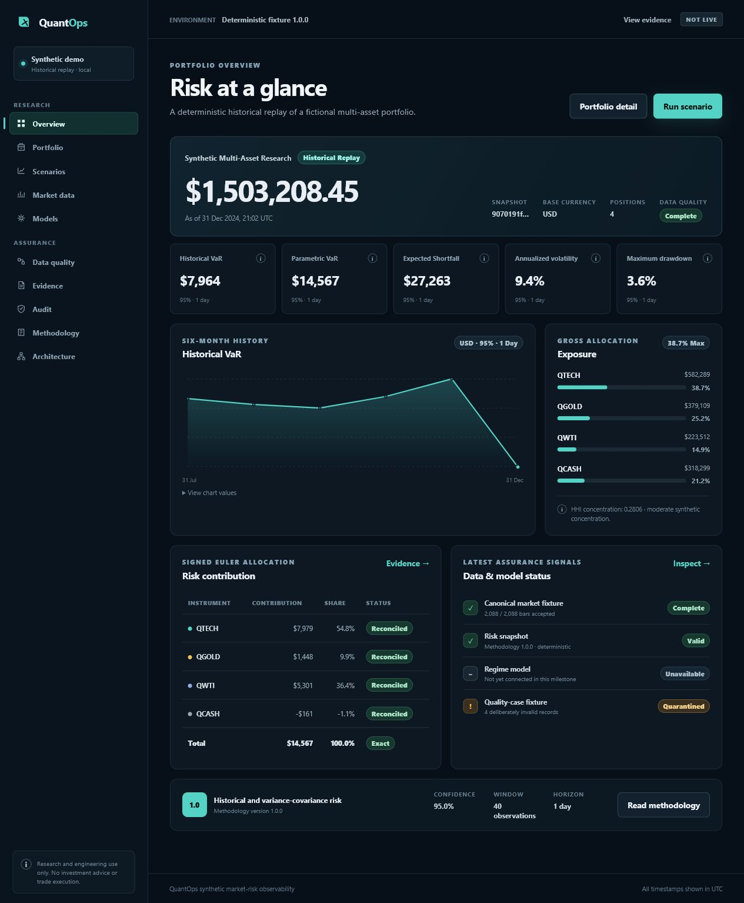
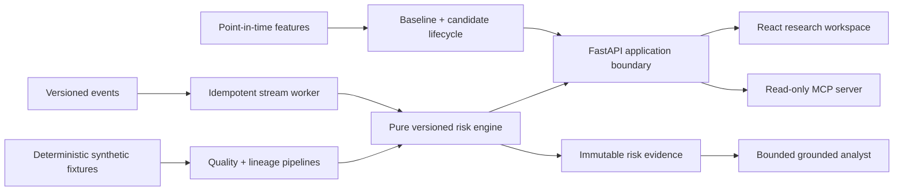

# QuantOps

### Market Risk, Data Lineage & Grounded AI Research Platform

[](https://www.python.org/)
[](https://fastapi.tiangolo.com/)
[](https://react.dev/)
[](LICENSE)

QuantOps is a production-style portfolio project for reproducible multi-asset market-risk research. It combines deterministic synthetic data, versioned financial analytics, traceable evidence, stress testing, a leakage-safe ML lifecycle, and a bounded AI analyst that can explain—but never invent or execute—risk decisions.



> **Observed status:** the deterministic domain, risk, data-quality, API, UI, ML, AI, event-contract, broker-neutral streaming, scheduling-core, and read-only MCP boundaries are implemented and tested. The UI currently uses a typed local demo adapter and the API uses a deterministic process-local service. Live PostgreSQL, Redpanda, Airflow, MLflow, and observability profiles remain environment-dependent and are not claimed as verified. See [implementation progress](docs/progress.md).

## The problem

Risk numbers are easy to display and difficult to trust. QuantOps is designed around the questions that follow a metric: Which portfolio version? Which prices? Which methodology? Was the data complete? Can the explanation be reconciled to immutable evidence?

The project deliberately does **not** connect to brokers, execute orders, forecast guaranteed returns, or provide buy/sell recommendations. Every bundled market record, portfolio, and research document is fictional and marked synthetic.

## Five-minute demo story

1. Open the portfolio dashboard and inspect value, historical/parametric VaR, Expected Shortfall, volatility, drawdown, and signed risk contributions.
2. Trace the snapshot to its methodology version, data-quality state, and evidence IDs.
3. Run the versioned `combined_liquidity_stress` scenario without mutating positions or prices.
4. Inspect deterministic data-quality and quarantine records from the canonical fixture.
5. Ask the grounded analyst why risk changed, verify its cited numbers, then try an investment-advice or prompt-injection request and observe the safe refusal.

[Scenario lab](docs/images/quantops-scenario-lab.png) · [stress result](docs/images/quantops-shock-scenario.png) · [grounded brief](docs/images/quantops-grounded-brief.png) · [model/drift](docs/images/quantops-model-drift.png) · [data quality](docs/images/quantops-data-quality.png)

## Architecture



The synchronous core is a modular monolith; batch, stream, scheduling, ML, AI, and MCP capabilities sit behind explicit boundaries. Pure domain and risk packages never import web frameworks, databases, brokers, or provider SDKs. See the [architecture diagrams](docs/architecture/overview.md) and [ADRs](docs/adr/).

## What is implemented

| Area | Evidence-backed capability |
| --- | --- |
| Financial risk | Arithmetic/log returns, valuation, volatility, covariance/correlation, historical and parametric VaR, Expected Shortfall, drawdown, concentration, signed contributions, scenarios, and VaR backtesting |
| Data | Fixed-seed 2,088-bar multi-regime fixture, manifests/hashes, quality cases, quarantine, lineage, and byte-reproducible generation |
| API | 31 versioned routes, OpenAPI snapshot, RFC 9457-style errors, bounded pagination, auth boundary, ETags, idempotency, rate limiting, and JSON/CSV exports |
| Streaming | Six strict v1 event contracts plus broker-neutral replay, duplicate/conflict handling, lateness policy, retry/DLQ behavior, and outbox publication ordering |
| ML | Ten point-in-time features, rule baseline, fixed-seed candidate, chronological evaluation, promotion gates, model card, reproducible artifacts, and drift checks |
| AI | Deterministic no-key brief, ten-tool read-only broker, scoped retrieval, citation/numerical validation, safe fallback/refusal, and 44 adversarial evaluation cases |
| MCP | Exactly three bounded read-only tools and one fixed methodology resource over local stdio |
| Product UI | Responsive research dashboard, portfolios, scenarios, evidence, data quality, model/drift, audit, methodology, and architecture views, covered by desktop/mobile Playwright and axe checks |

## Why this stack

- **Python 3.12+, FastAPI, Pydantic, SQLAlchemy, Alembic:** typed domain/application boundaries and inspectable OpenAPI/persistence contracts.
- **PostgreSQL + pgvector:** one transactional source of truth for portfolio state, outbox records, time-series facts, and approved retrieval metadata.
- **React + TypeScript + Vite:** a small, accessible product surface without a generic admin template.
- **Redpanda-compatible contracts:** Kafka semantics where replay and asynchronous decoupling add value, with honest at-least-once/idempotent behavior.
- **Pure-Python risk and ML cores:** deterministic tests and a no-service demo remain usable when optional infrastructure is unavailable.
- **Explicit AI state machine and MCP SDK:** small, auditable surfaces with budgets, allowlists, evidence checks, and no mutation tools.

## Quickstart (no paid services or API keys)

Prerequisites: Python 3.12+, [uv](https://docs.astral.sh/uv/), Node 22.12+, pnpm 11, and Git. Run `python scripts/doctor.py` for actionable diagnostics.

```bash
uv sync --locked --all-packages
pnpm install --frozen-lockfile

# terminal 1 — deterministic API
uv run uvicorn quantops_api.main:app --app-dir apps/api --reload

# terminal 2 — deterministic research UI
pnpm --filter @quantops/web dev
```

Open:

- UI: `http://localhost:5173`
- API docs: `http://localhost:8000/docs`
- health/readiness: `http://localhost:8000/api/v1/health` and `http://localhost:8000/api/v1/ready`

Optional Compose profiles reserve Airflow `:8080`, MLflow `:5000`, Redpanda Admin `:9644`, Prometheus `:9090`, and Grafana `:3000`; these integrations require Docker and are documented as pending until exercised on real services.

## Reproducible workflows

```bash
# regenerate and verify the canonical fixture
uv run python -m quantops_pipelines generate --output data/synthetic
uv run python -m quantops_pipelines verify --dataset data/synthetic

# run the leakage-safe model lifecycle
uv run python -m quantops_ml run \
  --prices data/synthetic/canonical/price_bars.csv \
  --manifest data/synthetic/manifest.json \
  --output data/generated/ml

# execute the checked AI safety/grounding evaluation
uv run python -m quantops_ai evaluate \
  --cases packages/ai_engine/evals/v1/cases.jsonl \
  --output data/generated/ai-evaluation.json
```

Canonical fixture SHA-256: `2796bd52b205182f471903f42638c6f6751093c658d1017ecf4be03c3c1b1150`.

## Methodology and safety in brief

Risk calculations are deterministic and versioned. Outputs expose units, sign convention, confidence, horizon, window, observation count, quality, and insufficient-data states; `NaN` is never presented as trustworthy risk. Scenario results are hypothetical sensitivity analyses, not forecasts. Full equations and assumptions are in the [risk methodology](docs/risk-methodology.md).

The AI layer never calculates authoritative figures. It can read only approved, portfolio-scoped evidence through bounded tools. Each factual factor needs a valid evidence ID; numerical claims are reconciled to canonical values; trade advice, execution, secrets, hidden prompts, prompt injection, and cross-scope access are refused. See the [AI system card](docs/ai/system-card.md) and [threat model](docs/security/threat-model.md).

## Quality gates

```bash
uv run ruff check .
uv run ruff format --check .
uv run python scripts/typecheck.py
uv run pytest -m "not integration and not e2e"
pnpm lint
pnpm typecheck
pnpm test
pnpm test:e2e
pnpm build
uv run python scripts/docs_check.py
uv run python scripts/security_scan.py
```

The latest recorded service-free core gate passed **468 Python tests plus 20 subtests**, **14 Vitest tests**, and **14 Playwright tests** across desktop and mobile Chromium. The browser suite includes automated WCAG A/AA scans and a keyboard-only scenario/evidence journey. Package-level branch coverage is recorded in [progress](docs/progress.md). The deterministic AI report passed **44/44 cases across 20 categories**. Live database/broker tests and local container smoke checks remain explicitly pending because Docker is unavailable in the current workstation environment.

## Repository map

```text
apps/       API, React UI, stream worker, scheduler, read-only MCP
packages/   domain, risk engine, event contracts, grounded AI
pipelines/  deterministic fixture generation and quality services
ml/         feature, baseline/candidate, promotion, artifact, drift lifecycle
data/       synthetic canonical data, manifests, quality cases, quarantine
docs/       architecture, ADRs, methodology, security, operations, evidence
infra/      optional local infrastructure profiles
```

## Limitations and roadmap

- PostgreSQL migrations and repository semantics compile and are tested offline, but the live critical path still needs a clean database run.
- Redpanda behavior is proven with deterministic broker-neutral ports, not a live cluster.
- The UI and API are independently runnable deterministic demos; generated-client integration is pending.
- Airflow, MLflow, external LLM, pgvector retrieval, telemetry, and Grafana remain optional profiles requiring separate verification.
- This is a research and engineering system, not a production trading or investment-advice service.

The exact completed/pending evidence is maintained in [docs/progress.md](docs/progress.md), with operational guidance in [runbooks](docs/operations/runbooks.md) and claim-to-test mapping in [engineering evidence](docs/engineering-evidence.md).

## License and authorship

[MIT](LICENSE). Author/profile: **owner review required before public portfolio use**.

AI-assisted implementation must be personally reviewed and understood before claiming authorship or using the project in recruitment.
