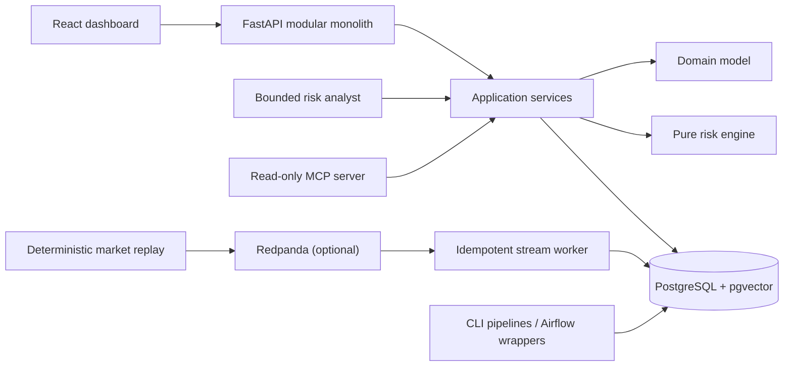

# Architecture overview

QuantOps uses a modular monolith for synchronous workflows and narrowly scoped workers for asynchronous replay, outbox publication, and scheduled pipelines.

The database is authoritative. Events provide replayable asynchronous decoupling with at-least-once semantics. The risk engine owns numerical calculations; the AI workflow can only retrieve bounded evidence and narrate validated results.
