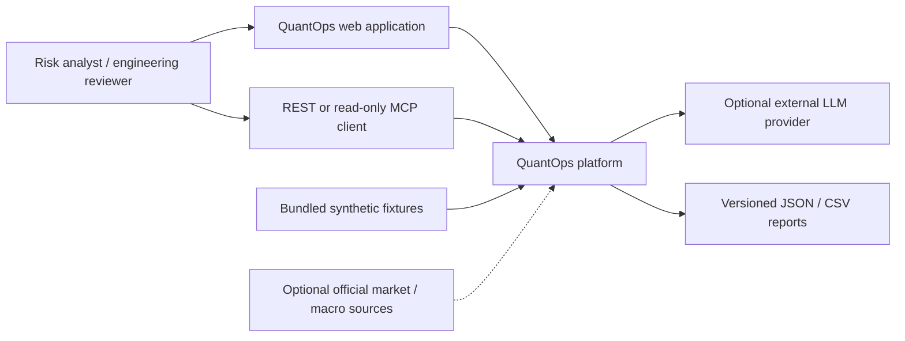
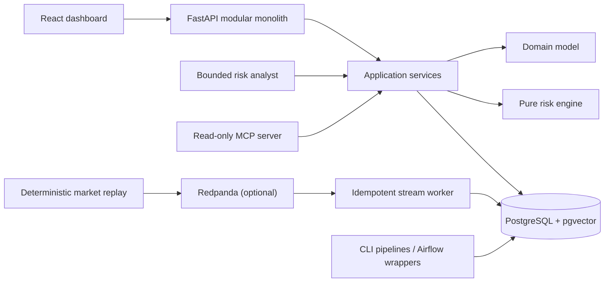
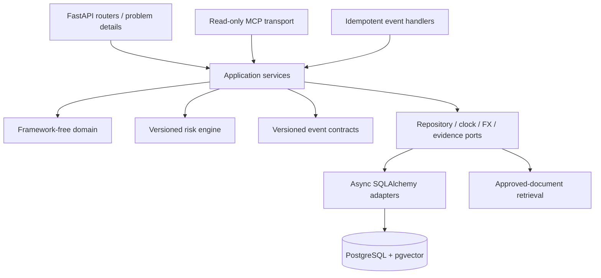
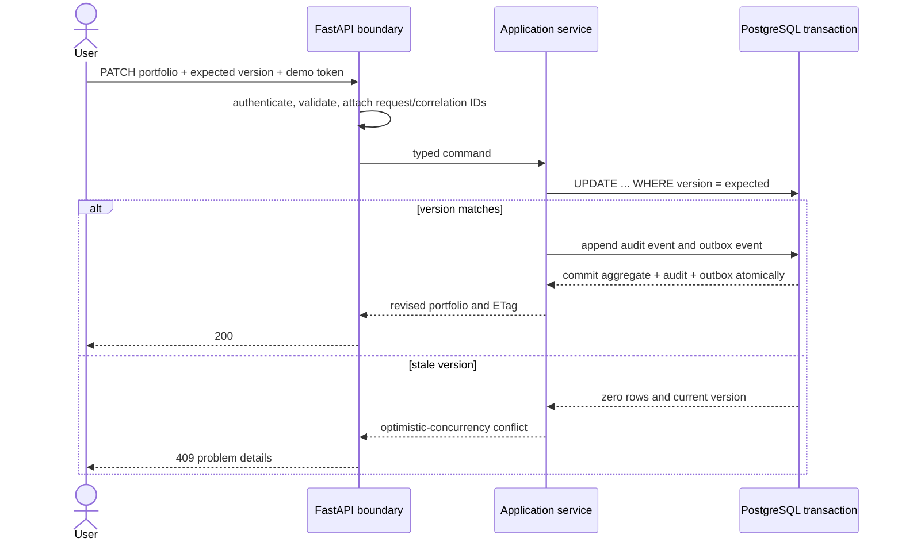
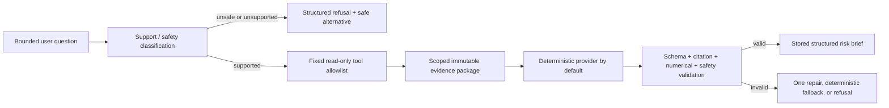
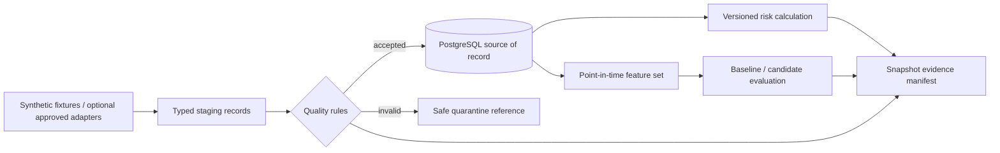
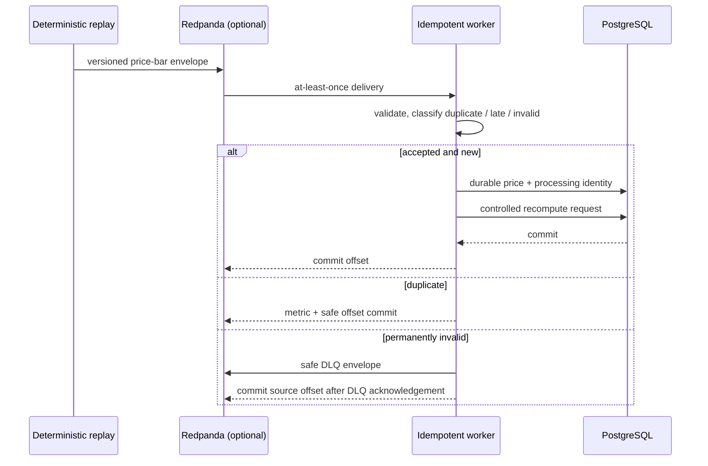
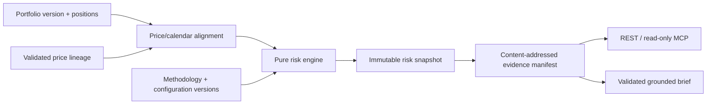
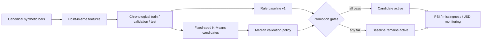

# Architecture overview

QuantOps uses a modular monolith for synchronous workflows and narrowly scoped workers for
asynchronous replay, outbox publication, and scheduled pipelines. Solid lines below describe the
target boundaries from the authoritative specification; `docs/progress.md` is the source of truth
for which adapters have actually passed their exit evidence.

## System context

The default demonstration needs no live market source or external LLM. Optional boundaries must
fail closed or degrade visibly without making deterministic risk calculations unavailable.

## Container boundaries

The database is authoritative. Events provide replayable asynchronous decoupling with at-least-once semantics. The risk engine owns numerical calculations; the AI workflow can only retrieve bounded evidence and narrate validated results.

## Application component boundary

Dependencies point inward. Domain and risk modules do not import FastAPI, SQLAlchemy, Kafka,
MLflow, or provider SDKs. Transports validate and authorize input; application services coordinate
transactions; database and provider details remain replaceable adapters.

## Guarded portfolio-write flow

The outbox is at-least-once: a publisher may send a row more than once. Stable idempotency keys and
consumer-side processing records prevent duplicates from changing authoritative state twice.

## Evidence-grounded explanation flow

Generated language never becomes an authoritative risk value. Retrieved text is untrusted data,
not instruction, and factual factors must cite evidence inside the selected portfolio/snapshot
scope.

## Batch data and lineage flow

Every reusable pipeline owns a typed configuration hash, run/correlation ID, watermark where
appropriate, and deterministic record counts. Airflow may schedule these services but does not own
their business logic.

## Streaming event flow

Possible duplicate publication is part of the design. The live broker path must not be described as
verified until the Redpanda integration gates in `docs/progress.md` pass.

## Risk computation and evidence flow

## ML training, promotion, and monitoring flow

The current candidate is rejected and the baseline remains active. This classification describes a
risk state; it is not a price or return forecast.
