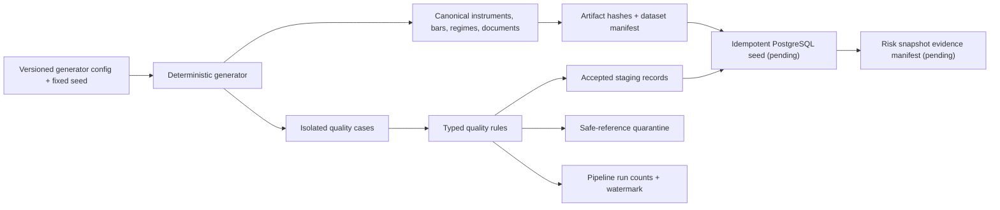

# Data quality and lineage

## Fixture identity

The default QuantOps dataset is entirely synthetic. Generator seed `20250317` produces 522 Monday–Friday dates from 2023-01-02 through 2024-12-31 for four fictional instruments: `QTECH`, `QGOLD`, `QWTI`, and `QCASH`. The 2,088 accepted canonical OHLCV bars are labelled `is_synthetic=true`.

Five explicit regimes make behavior inspectable rather than accidental:

1. normal low volatility;
2. risk-on trend with weaker cross-asset correlation;
3. abrupt volatility shock;
4. cross-asset correlation breakdown;
5. partial recovery.

The aggregate dataset SHA-256 is `2796bd52b205182f471903f42638c6f6751093c658d1017ecf4be03c3c1b1150`. `data/synthetic/manifest.json` records the fixed configuration, individual artifact hashes, byte sizes, record counts, and aggregate hash. Verification recomputes these values and fails on tampering.

## Batch lineage

The current file pipeline is complete through deterministic artifacts, validation, quarantine, and run evidence. PostgreSQL upsert IDs and downstream risk-snapshot lineage are intentionally still pending and are not claimed.

## Intentional quality cases

Quality demonstrations are isolated from canonical accepted bars in `data/synthetic/cases/quality_cases.json`:

- one missing `QGOLD` business-day bar;
- one late `QWTI` event;
- one duplicate `QTECH` event;
- one malformed `QTECH` OHLC event.

The quality run reads 20 staging events, accepts 17, and produces four quarantine records/four stable issues because the missing-bar rule contributes an issue without an input row. Quarantine stores a safe payload reference and rule metadata rather than blindly copying arbitrary raw content.

## Determinism and idempotency

The generator does not use global randomness, network access, wall-clock time, or machine locale. A SHA-256 counter stream and deterministic Box–Muller transformation produce stable numerical draws. Canonical JSON uses stable key ordering and separators; CSV uses fixed column order/newlines/decimal formatting.

Writes are content-aware. Re-running against a valid existing dataset produced `files_written=0` and `files_unchanged=11`. This proves file-generation idempotency. Database upsert idempotency remains a separate Milestone 2 gate and must be enforced with PostgreSQL uniqueness constraints and repository tests.

## Documents and AI boundary

All four research documents are fictional and approved for the demo. One risk-committee fixture includes an inert prompt-injection sentence so the future retrieval workflow can prove that document text is untrusted data, never instructions. No copyrighted news archive or arbitrary scraped webpage is stored.

## Limitations

- Monday–Friday dates are not an exchange-specific holiday calendar.
- Regime labels are generator truth for engineering tests, not claims about real markets.
- Volume and correlation dynamics are deliberately simplified.
- Canonical fixture completeness does not prove a live adapter is complete or timely.
- Database lineage, partition IDs, and snapshot evidence are pending persistence integration.
