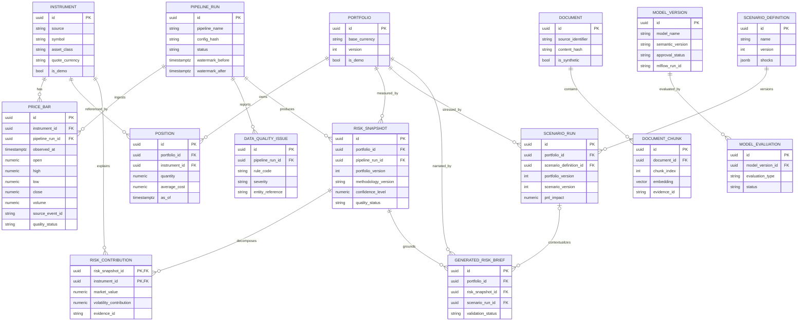

# PostgreSQL data model

QuantOps uses UUID primary keys, UTC-aware timestamps, explicit `NUMERIC` precision for quantities/money, named constraints, and query-driven indexes. PostgreSQL is the durable source of truth; domain objects remain independent from SQLAlchemy.

`MARKET_EVENT`, `AUDIT_EVENT`, and `OUTBOX_EVENT` are append-oriented operational records. They carry correlation/causation identifiers without owning the aggregates they reference. The outbox row is inserted in the same transaction as business state and may be published more than once; consumers must remain idempotent.

## Important constraints

- Instrument identity is unique on `(source, symbol)` and symbols are canonical uppercase.
- Price bars are unique on `(instrument_id, interval, observed_at, source)` and `(source, source_event_id)`; OHLC, positive-price, volume, interval, and currency checks reject invalid rows.
- A position is point-in-time unique for `(portfolio_id, instrument_id, as_of)` and stores quantity/average cost as `NUMERIC(38, 12)`.
- Portfolio writes guard the stored version and raise an optimistic-concurrency error when an expected version no longer matches.
- Risk snapshots bind a portfolio version, methodology version, window, confidence, pipeline run, quality state, and evidence manifest.
- Scenario definitions and results are versioned; results are immutable application facts.
- Document chunks are unique by `(document_id, chunk_index)` and evidence ID. Vector dimensions are fixed by the schema.
- Outbox idempotency keys are unique. Status/timestamp/attempt checks prevent contradictory publication state.

## Time-series policy

The initial demo migration keeps `price_bars` as a regular table with descending instrument/time and latest-price indexes. The deterministic fixture is intentionally small, so declarative time partitioning would add migration and uniqueness complexity without improving the required demo. A production-volume migration should introduce range partitions by `observed_at`, create future partitions before cutover, and retain an idempotency constraint whose key includes the partition column or a separate global event ledger. This is a documented scaling path, not a claim that the initial table is already partitioned.

## Migration ownership

Alembic owns schema evolution. The first revision enables the `vector` extension and creates the complete application schema. Extension availability, migration upgrade, constraints, and query behavior require PostgreSQL integration verification; offline SQL compilation alone is not evidence of a successful live migration.
