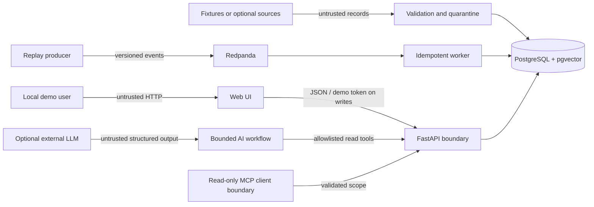

# QuantOps threat model

Last reviewed: 2026-07-19

## Scope and trust boundaries

This model covers the local/demo web application, FastAPI boundary, PostgreSQL/pgvector store,
fixture and optional live ingestion adapters, Redpanda replay workers, model artifacts, grounded-AI
workflow, read-only MCP server, CI, and exported reports. Browser input, event payloads, retrieved
documents, model files, provider responses, and external-source data are untrusted. The numerical
risk engine and validated immutable evidence are authoritative; generated prose is not.

The required demo is single-user and synthetic. It has no brokerage integration, order execution,
or investment-advice function. Docker profiles and optional providers enlarge the attack surface
only when explicitly enabled.

## Assets

- portfolio, position, price, risk, scenario, lineage, audit, and outbox integrity;
- methodology/model/artifact version identity and reproducibility metadata;
- demo token, database credentials, provider keys, and CI credentials;
- approved-document scope, evidence IDs, citations, and numerical consistency;
- service availability and bounded resource use;
- contributor source history and release provenance.

## Threats and controls

| Threat | Representative abuse | Required controls and current design |
| --- | --- | --- |
| Spoofing | Anonymous portfolio mutation or forged service identity | Demo token on every state-changing route; constant-time comparison; production OIDC path; database/service credentials supplied only at runtime. |
| Tampering | Altered prices, duplicate events, stale portfolio overwrite, or replaced model artifact | Validated schemas; checksums; deterministic manifests; database constraints; optimistic versions; idempotency keys; transactional outbox; artifact hashes and approval metadata. |
| Repudiation | A write, recomputation, model action, or AI tool use has no trace | UTC audit records with actor, action, aggregate, request/correlation IDs, bounded safe details, and append-oriented storage. Never log authorization values or hidden prompts. |
| Information disclosure | Stack trace, secret, cross-portfolio evidence, raw SQL, or hidden prompt leaves the boundary | RFC 9457 safe errors; output allowlists; evidence scope checks; read-only bounded tools; secret-pattern scans; log redaction; no chain-of-thought exposure. |
| Denial of service | Oversized JSON/event, unbounded date range, recursive tool loop, expensive recompute flood, or broker retry storm | Pre-parse byte limits, bounded pagination/windows/results, request timeouts, rate limits, fixed tool-call/retry/token budgets, backoff and dead-letter policy, readiness and graceful degradation. |
| Elevation of privilege | UI-only checks, prompt-driven tool selection, arbitrary MCP mutation, or CI credential abuse | Authorization in application code; fixed read-only AI/MCP allowlists; no dynamic SQL or URL fetching; least-privilege GitHub permissions; no deploy from pull requests. |

## Financial and AI-specific abuse cases

- Money and quantities use `Decimal`/`NUMERIC`; timestamps must be UTC-aware; currency mixing is
  rejected unless an explicit tested FX boundary supplies rates.
- Invalid, stale, partial, or insufficient data must never be labeled trustworthy. Scenario output
  is hypothetical, versioned, and cannot mutate the source portfolio.
- Retrieved document text is data, never instruction. Prompt-injection phrases inside documents,
  portfolio names, event fields, or provider output cannot add tools or override refusal rules.
- Buy/sell/short advice, guaranteed forecasts, execution, secret requests, hidden-prompt requests,
  arbitrary browsing, and attempts to bypass citations are refused with a safe alternative.
- Every factual factor must cite an in-scope evidence ID. Metric/value claims are compared with
  canonical evidence and permitted display rounding. Unknown, duplicate, fabricated,
  cross-portfolio, or unused citations fail validation.
- Optional external-provider invalid JSON, timeout, fabricated citation, or inconsistent number
  falls back to the deterministic provider or a bounded refusal; risk calculation remains usable.

## Data and supply-chain controls

Fixture and adapter records enter staging before typed quality rules. Duplicates are idempotent;
malformed records are quarantined; late data is visible; watermarks cannot advance past failed
acceptance. Live source failures must be graceful and CI never contacts live sources.

Dependencies are locked. CI should run format/lint/type/tests, migration and event integration,
frontend build, deterministic ML/AI evaluation, dependency/secret scans, container smoke tests, and
SBOM generation. Actions receive minimal permissions and releases occur only from explicit tags
after required checks. Repository publication must not include `.env`, databases, caches, model
runs, credentials, or generated secrets.

## Residual risks and verification gaps

- The demo token is not production identity and does not provide multi-tenant isolation.
- Local PostgreSQL/pgvector and Redpanda integration behavior is unverified until Docker or isolated
  services are available; offline DDL compilation is not equivalent evidence.
- Optional external APIs have independent privacy, retention, rate-limit, and availability risks.
- Statistical models trained on synthetic regimes may not generalize to real markets and must not
  be presented as price predictors or profitability signals.
- Before a public release, run clean-room setup, dynamic endpoint tests, container scans, secret
  scanning, dependency review, license review, and an owner-reviewed incident contact path.

## Security regression checklist

1. Try missing, incorrect, and oversized demo tokens on every write route.
2. Submit naive timestamps, non-finite values, oversized payloads, duplicates, and future event
   versions.
3. Attempt stale portfolio writes and repeated idempotency keys with conflicting payloads.
4. Use unknown/cross-portfolio evidence and fabricated numerical claims.
5. Place prompt injection in portfolio names and approved-document text.
6. Request trades, execution, credentials, hidden prompts, arbitrary URLs, and excessive tool loops.
7. Interrupt PostgreSQL, broker, model registry, and external provider separately; verify bounded
   readiness/degradation and no data corruption.
8. Inspect logs, traces, exports, error responses, and build artifacts for secrets and sensitive
   payloads.
